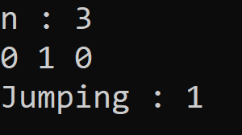
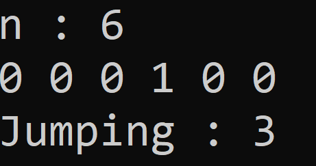
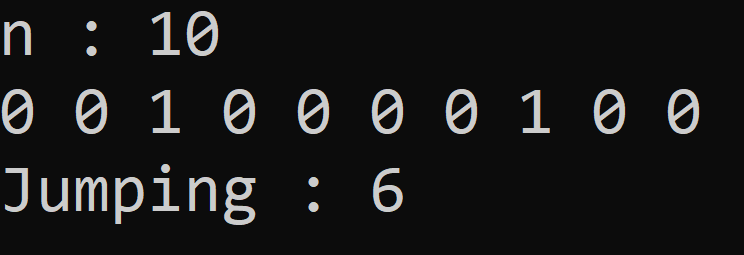

# Jumping-on-the-Clouds

Bulut kümelerinin üzerinde 1 veya 2 zıplayarak ilerleniyor. Bulut kümesi 0 ve 1 olarak belirtilmiştir ve biz sadece 0'ların üzerinde zıplayabiliyoruz. En kısa zıplama sayısını 
bulmaya çalışacağız. 
<b>Örneğin : c=[0,1,0,0,0,1,0]</b>  
<b><i>index</i></b> => 0 -> 2 -> 4 -> 6 indislerinde zıplayabiliriz ve burada 3 zıplama var  <b><i>index</i></b> => 0 -> 2 -> 3 -> 4 -> 6 indislerinde zıplayabiliriz ve burada 4 zıplama var.  
En az zıplama istediği için return 3 olur.  
  
